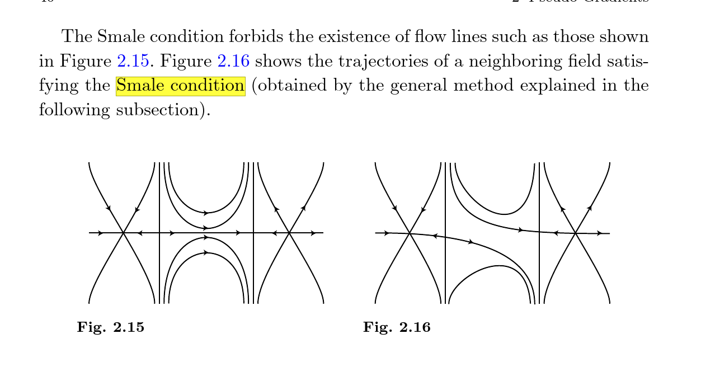

---
title: "Chapter 10"
--- 

[Audin-Damian Morse Theory and Floer Homology](../../../Book%20Notes/Audin-Damian%20Morse%20Theory%20and%20Floer%20Homology/Audin-Damian%20Morse%20Theory%20and%20Floer%20Homology.md)

Tags: #symplectic #topology #geometry #floer

# Monday, October 12: Audin Chapter 10 (From Floer to Morse)

## Notation and Setup

- $(W, \omega, J)$ a symplectic manifold with an almost complex structure

- $H\in C^\infty(W, \RR)$ will be either a Morse function or a Hamiltonian
- $X$ will be a vector field, potentially $X_H$, the symplectic gradient of $H$:
  \[  
  \omega_x(\wait , X_H(x)) = (dH)_x(\wait) 
  .\]

- $DH$ will denote differentials, $D^2 H$ will denote Hessians (where they're defined)

- $CM_*(H, J)$ will be the Morse complex associated with a Morse function $H$, its vector field $\grad H$ the gradient for the metric defined by $J, \omega$.

- $CF_*(H, J)$ will be the Floer complex

:::{.theorem title="Main Goal"}
There exists a nondegenerate Hamiltonian that is sufficiently small in the $C^2$ topology for which both the Floer and Morse complexes are well-defined, and 
\[  
CF_*(H, J) \cong CM_{*+n}(H, J) = CM_*(H, J)[n]
.\]
:::

## Strategy

Need to show two things:

1. $CF_* = CM_*[n]$, and
2. $\bd_F = \bd_M$.

### Equality of Complexes 

:::{.definition title="Nondegenerate 1: Critical Points of a Function"}
For a function $f \in C^\infty(W, \RR)$, define a bilinear form 
  \[
  (D^2 f)_p: T_p W \tensor T_p W &\to \RR \\
  (\vector v, \vector w) &\mapsto \inner{ \vector x}{(Y\cdot f)(p)}
  \] 
for some vector field $Y$ extending $\vector y$.

A critical point $p$ is **nondegenerate** iff $(D^2 f)_p$ is a nondegenerate quadratic form.
:::

:::{.definition title="Nondegenerate 2: Critical Points of Periodic Trajectories"}
For a Hamiltonian system $H$, a periodic solution $x$ is **nondegenerate** iff $1 \not\in \spec(d\psi_1)$, i.e. 1 is not an eigenvalue of the differential, i.e. 
\[
\det\qty{\id - \qty{D\psi^1}_{x(0)} } \neq 0
.\]
:::

:::{.example}
Motivation: 
  \[  
  H=\frac{1}{2} \sum a_{i j} p_{i} p_{j}+\sum b_{i j} p_{i} q_{j}+\frac{1}{2} \sum c_{i j} q_{i} q_{j} \implies X_H \vector p = A \vector p, A \approx D^2 H(0)
  .\]

Yields a flow $\psi_t = e^{tA}$, then if $\psi_1 = e^A$ doesn't have eigenvalue 1, $A$ doesn't have eigenvalue zero, and the quadratic form $H$ is nondegenerate, so the critical point of $H$ at zero is nondegenerate.
:::

:::{.proposition title="5.4.5"}
Definition 2 implies definition 1: if $x$ is a critical point of $H$ which is nondegenerate as a periodic solution of the Hamiltonian system, then $a \in \crit(H)$ is nondegenerate as a critical point of the *function* $H$.
:::

- Can start with an $H_0$ and rescale to define $H \da H_0/k$
- When $H$ sufficiently small in the $C^2$ sense (close sups of 1st and 2nd derivatives), the only periodic trajectories are constant
  - Use prop: def 2 implies def 1, conclude that $H$ is Morse.
  - As a result,
  \[  
  \crit(\mathcal{A}_H) \iff \crit(H) \iff \ts{\text{Constant trajectories}}
  .\]
  - Use remark 5.4.6: for the Hessian  of $H$, $\spec(D^2 H) \intersect 2\pi \ZZ = \emptyset$
  - Yields *Index Comparison Formula*: 
  \[  
  \ind_H(x) = \mu(x) + n
  .\]

**Goal by end of Ch. 10**:

- Show that all Floer solutions connecting two consecutive critical points are *also* Morse trajectories, 
- Regularity: $d\mathcal{F}_u$ is surjective along these trajectories
  - Implies $\mathcal{M}^{(H, J)}(x, y)$ is a manifold, allows defining Floer complex

- Index Comparison Formula **yields equality of vector spaces**, up to a dimension shift.

\newpage

### Equality of Differentials

- Next need to show both differentials $\bd_M, \bd_F$ can be defined, and they coincide

- Defining $\bd_M$:
  - Need a vector field $X$ adapted to $H$
  - $X$ needs to satisfy Smale condition (genericness)

- Recall the **Smale Condition**: all stable and unstable manifolds of critical points meet transversely,
\[  
W^{\text{u}}(a) \transverse W^{\text{v}}(b) \qquad\forall a, b\in \crit(H)
.\]

- Goal: given fixed data for the Floer theory, relate it to Morse data (define the Morse complex).

- Strategy: running ideas backwards, getting theorems for Morse functions similar to what we did when linearizing the Floer operator

### Define Morse Differentials

- To define $\bd_M$: need to relate trajectories of $X$ to solutions of Floer equation:
\LARGE
\[  
\correspond{ \text{Solutions to } \\ \\ \dd{u}{s} + X(u) = 0  }
\iff
\correspond{ \text{Solutions to } \\ \\ \dd{u}{s} + J(u) \dd{u}{t} + \grad H(u) = 0 }
.\]
\normalsize

  To do this: need $X = \grad H$ for the metric induced by $J, \omega$.

:::{.definition title="Pseudo-Gradient"}
For $f:W\to \RR$ a Morse function, a vector field $X$ is a **pseudo-gradient** for $f$ iff

1. $(Df)_p(X_p) \leq 0$ with equality iff $p\in \crit(f)$
2. In a Morse chart about $p\in \crit(f)$, we have $X = -\grad_g f$ for the canonical metric $g$ on $\RR^n$.
:::

:::{.definition title="Morse-Smale Pair"}
A pair $(f, X)$ of a function and a vector field is a **Morse-Smale pair** iff $f$ is Morse and $X$ is a pseudo-gradient for $f$ satisfying the Smale condition.
:::

:::{.theorem title="Theorem to Prove"}
Let $H$ be Morse on $(W, \omega)$.
Then there exists a dense subset $\mathcal{J}_{\text{reg}}(H)$ of almost complex structures $J$ calibrated by $\omega$ such that $(H, -JX_H)$ is Morse-Smale.

> Note: transversality result analogous to ones in 8.5
:::

:::{.proof}
\hfill

- Proof in two steps:

  - Step 1: Morse Side, arbitrary morse functions
    - Linearize the Morse equation $\dd{u}{s} + X(u) = 0$ of the flow of $-X$ along one of its solutions $L_u Y = 0$.
    - Show that whenever $H$ is Morse and $u$ is a trajectory connecting critical points, $L_u$ is Fredholm and 
  \[\ind(L_u) = \ind_H(y) - \ind_H(x).\]
    - Show that for $H$ a nondegenerate Hamiltonian and $u$ a trajectory of $JX_H$, the operators $(d\mathcal{F})_u$ and $L_u$ are Fredholm of equal index.
    - Show that $X$ is Smale $\iff$ $L_u$ is surjective.
  - Step 2: Floer Side, specific case of Hamiltonian
    - Prove the actual result.
:::

- Now fix an almost complex structure to obtain a Smale vector field $X$

\newpage

### Compare solutions to Floer equation and trajectories of $X$

- Goal: for $\ind(x) - \ind(y)\leq 2$, get an equality
\[  
\correspond{\text{Trajectories of Floer equation} \\ \text{associated to }(H, J) \text{ connecting }x, y} 
\iff
\correspond{\text{Trajectories of the Smale } \\ \text{vector field } -JX_H}
.\]

- Solutions to Floer equation that *do not* depend on $t$ are precisely trajectories of $X = - \grad H$.

- Next show that elements in $\ker (d\mathcal{F}_u)$ do not depend on $t$.
- Corollary: $d\mathcal{F}_u$ is surjective along every trajectory of $\grad H$.
- Then show that replacing $H_k \da H/k$ for $k\gg 0$ preserves all critical points and all indices
- Punch line: all the solutions of the Floer equation that we need are time-independent.
  - Statement: For $k\gg 0$, solutions to the Floer equation for $H_k$ connecting $x\to y$ with $\ind(x) - \ind(y) \leq 2$ are independent of $t$.

## Summary

- Take $H_k$ for $k\gg 0$ and $J\in \mathcal{J}_{\text{reg}}$ (dense)
- Then when $\ind(x) - \ind(y) \leq 2$, trajectories of Floer equation for $(H, J)$ connecting critical points $x, y$ are trajectories of the Smale vector field $X = - JX_H$.
  - $x, y$ will be critical points for both $H$ and $\mathcal{A}_H$
- Regularity? The linearized Floer operator is surjective along these trajectories
- Implies that $\mathcal{M}^{(H, J)}(x, y)$ is a manifold, so $CF_*$ can be defined.
- Claim: this shows the differentials coincide, and we're done.

\newpage

## Linearizing the Morse Equation

- Let $f$ be morse on $V \injects \RR^m$ ($m\gg 0$) with adapted pseudo-gradient field $X$, then

\LARGE
\[  
\correspond{
\text{Trajectories} \\
\text{of } X
}
\iff
\correspond{
\text{Solutions of} \\
\dd{u}{s} + X(u(s)) = 0
}
.\]
\normalsize

- Fix a metric $g$ on $V$ such that $X = \grad_g f$.
- Define the space of solutions of finite energy:
\[  
E(u) &\da 
\int_\RR \norm{\dd{u}{s}}^2 \,ds \\
\mathcal{M} &\da \ts{
u \in C^\infty(\RR, V) \st \dd{u}{s} + \grad f = 0, \quad E(u) < \infty
}
.\]

- Then $\mathcal{M}$ is compact and equal to $\union_{x, y} \mathcal{M}(x, y)$, using the fact that if $V$ is compact, *all* trajectories are of finite energy

- Now go to coordinates and linearize the equation of the flow along the solution $u$ to get a linear differential equation

- Yields an equation
\[  
L_u: W^{1, 2}(\RR, \RR^{n}) &\to L^2(\RR, \RR^{n}) \\
Y &\mapsto \dd{Y}{s} + A(s) Y \da L_u Y
,\]
  where $A$ is a matrix limiting to $\grad_y^2 f$ and $\grad_x^2 f$ at $s= \pm \infty$

  - Limiting to Hessians of nondegenerate critical points will yield symmetric invertible matrices

  - We then consider $\ker L_u \subseteq \ker(d\mathcal{F}_u)$. 
    Note: we have exponential decay.

- Note: the space of solutions to equation linearized at $u$ is $T_u \mathcal{M}(x, y)$.

### Showing $L_u$ is Fredholm

- Bootstrapping: $Y\in \ker(L_u)$ in $W^{1, 2}$ is continuous, thus $C^1$, this $C^\infty$ and form a finite-dimensional vector space.

- Behavior at infinity: reduces to \[L_uY = 0 \iff \dd{Y}{s} = -AY\] where $A$ is a constant diagonal matrix
  - This is a linear system, so solutions are 
  \[
  Y(s) = e^{-As}Y(0)
  \quad\text{i.e.}\quad
  y_i(s) = y_i e^{- \lambda_i s}
  .\]

- Will prove that if $u$ is a trajectory of $\grad f$ connecting $x\to y$ then $L_u$ is Fredholm

  - Proof: involves bounding $W^{1, 2}$ norm of $Y$ by $L^2$ norms of $Y, L_u Y$.

  - Lots of integral estimates: Fourier transform, Plancherel, Cauchy-Schwarz

- Integral bound yields: $\dim \ker L_u < \infty$ and $\im L_u$ is closed.

- Lemma: $\dim \cok < \infty$.

  - Proof: computer kernel of adjoint \[L_u^* = -\dd{}{s} + A^*\] where the matrix is transposed.

  - Use the fact that \[Z\in \coker(L_u) \iff Z\in \ker(L_u^*),\] i.e. $L_u^* Z = 0$ in the sense of distributions

### Computing $\ind L_u$

- Unsurprisingly, will show $\ind(L_u) = \ind_f(x) - \ind_f(y)$.

- Ideas in proof:

  - Will choose two real numbers $\sigma, s$ to plug into $u$, and consider *resolvent*: map between tangent spaces to $V$ at $u(\sigma), u(s)$.
  - Look at the tangent spaces at $u(\sigma)$ of the stable and unstable manifolds will be the Floer complex
  \[  
  E^\text{u}(\sigma) \da T_{u(\sigma)} W^\text{u}(x) \\
  E^\text{s}(\sigma) \da T_{u(\sigma)} W^\text{s}(x) \\
  .\]
  - Then $\ker L_u$ is isomorphic to the intersection for all $\sigma$.

### Smale Condition

- Recall $X= \grad_g f$ for $g$ a metric.

- Statement: the vector field $X$ satisfies the Smale condition $\iff$ all $L_u$ are surjective.

:::{.proof}
\hfill

- $L_u$ is surjective $\iff \cok(L_u) = 0 \iff \ker(L_u^*)$ is injective
- This is equivalent to 
\[  
T_{u(\sigma)} W^\text{u}(x) +
T_{u(\sigma)} W^\text{s}(x) = T_{u(\sigma)} V
.\]
- This is exactly the transversality condition for the stable and unstable manifolds
  - We want this for all critical points
:::

## 10.4: Morse and Floer Trajectories Coincide

### Comparing Kernels

- Note $\ker(L_u) \subset \ker(d\mathcal{F}_u)$ since
\[  
\qty{ \dd{}{s} + S(s) }Y = 0 \implies
\qty{ \dd{}{s} + J\dd{}{t} + S(s) }Y = 0
,\]
  so just need to show reverse inclusion.

- Use a lemma: for $f: [0, 1] \to \RR$,
\[  
\norm{f}_{L^p([0, 1])} \leq
\norm{\dd{f}{t}}_{L^p([0, 1])}
,\]
  then apply this to $f(t) \da Y(s, t)$ and $p = 2$.

- Yields an equation
\[  
\norm{\dd{Y}{s} }_{L^2}^2 + \norm{\dd{Y}{t} }_{L^2}^2 \leq \sup_s \norm{S(s)}_{\text{op}}^2 \norm{Y}_{L^2}^2 
\implies
\norm{Y}^2_{L^2} \leq \sup_s \norm{S(s)}_{\text{op}} \norm{Y^2_{L^2}}
\]
  where the sup term being small forces $Y=0$.

### Trajectories are Independent of $t$ 

**WTS**: 
Trajectories of $H_k$ appearing in the Floer complex are exactly those appearing in the Morse complex.
I.e. proving 10.1.9

 
 Idea of proof:

- Contradiction: suppose there exists a sequence $n_k\to \infty$ with time-dependent solutions $u_{n_k}$ connecting $x\to y$ which solve the Floer equation

- Consider case where indices differ by $1$: using broken trajectories theorem, extract a subsequence converging to some $v\in \mathcal{M}(x, y, H)$.

  - Show $v$ doesn't depend on $t$

  - Since $d\mathcal{F}_v$ is surjective, $v$ is in a 1-dim component, and thus an isolated point of $\mathcal{L}(x, y)$

  - Get a contradiction from taking $k\gg 0$ and using 
  \[v_{n_k}(s, t) = v(s + \sigma_k, t) = v(s + \sigma_k),\] 
  which does *not* depend on time

- Consider case where indices differ by 2

  - Use Smale property of the gradient $-J X_H$ of $H$: trajectories $x\to y$ form a 2-manifold

  - Since trajectories are also in $\mathcal{M}(x, y, H)$, parameterizes a submanifold in a neighborhood of $v$.

- Show that convergence toward broken orbits in Morse setting corresponds to converges toward broken trajectories in Floer setting

- Use gluing from last chapter: $\hat{v}_{n_k} \in \im{\hat\phi}$ for $k\gg 0$, contradicting the fact that $v_{n_k}$ doesn't depend on $t$
